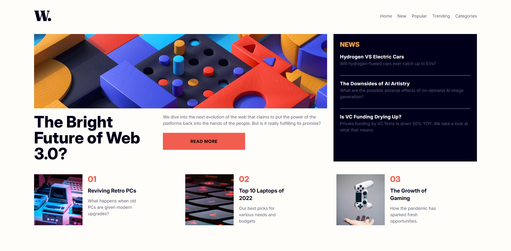
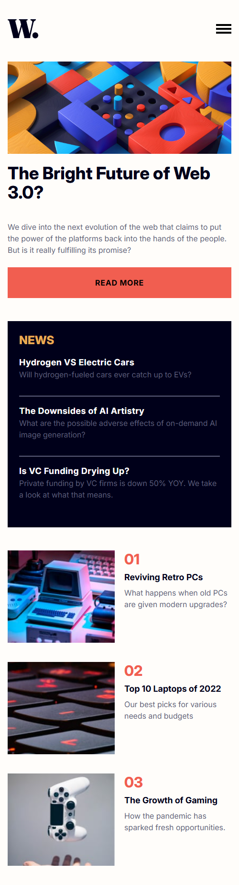

# News Homepage

## A responsive news layout with featured article, structured sections, and animated mobile navigation

This project implements a responsive news homepage layout featuring:

- A prominent featured article section

- An aside section highlighting three additional articles

- A secondary row containing three more articles

- A responsive navigation menu with animations for mobile devices

The layout combines CSS Grid and Flexbox to create a structured, scalable design. Grid is used for overall page composition and article placement, while Flexbox manages alignment and smaller layout components.

Special attention was given to semantic HTML and SEO best practices. The project uses meaningful structural elements and a logical content hierarchy to improve accessibility, readability, and search engine optimization.

The application is fully responsive and adapts smoothly across desktop, tablet, and mobile screen sizes.

### Screenshots

#### Image of the Desktop Design

#### Image of the Mobile Design

### Built with

- [React](https://react.dev/) - JS library
- [TypeScript](https://www.typescriptlang.org/) - type superset of JS
- [Tailwindcss](https://tailwindcss.com/) - utility-first CSS framework

## Author

- Website - [Mihailo Djurovic](portfolio-miahilo.vercel.app)